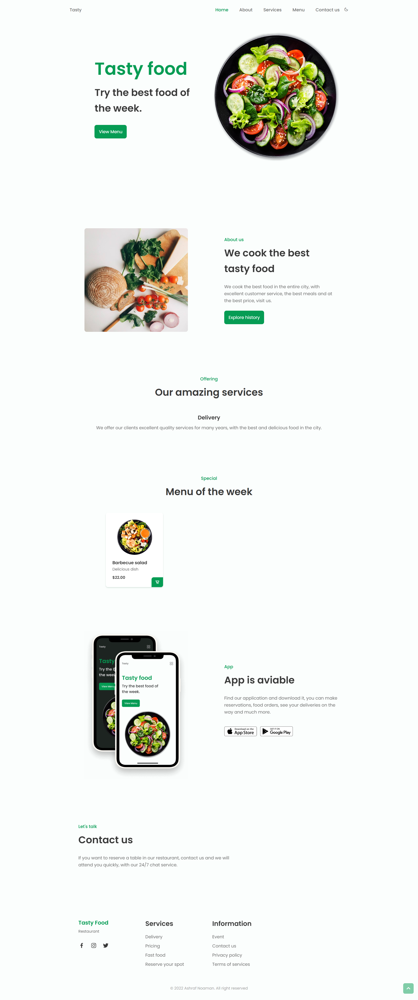

# 🍽️ Restaurant Landing Page

A modern and responsive landing page for a restaurant built using **JavaScript**, **HTML**, and **CSS**.

---

## 🌟 Features
- 🎨 Clean and attractive user interface to showcase menu and services
- 🔽 Smooth scrolling navigation for better user experience
- ✨ Interactive elements to engage visitors
- 📱 Fully responsive design for mobile, tablet, and desktop

---

## 🛠️ Tech Stack
- JavaScript
- HTML
- CSS
- SCSS (used for styling)

---

## 📸 Screenshot


---

## 🚀 How to Run
1. Clone the repository:
   ```bash
   git clone https://github.com/Ashraf-noaman/RESTURANT.git
